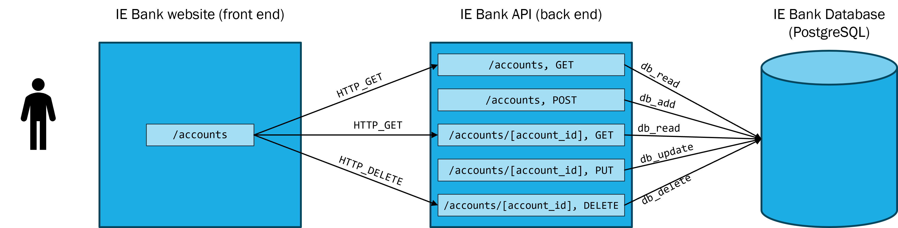

# IE Bank backend

- [IE Bank backend](#ie-bank-backend)
  - [Overview](#overview)
  - [Requirements](#requirements)
  - [Recommended tutorials](#recommended-tutorials)
  - [Configure your local environment](#configure-your-local-environment)
    - [Install Prerequisites](#install-prerequisites)
    - [Set up your local environment with VSCode](#set-up-your-local-environment-with-vscode)
  - [Run and debug the backend locally](#run-and-debug-the-backend-locally)
  - [Configuration variables](#configuration-variables)
  - [Continuos Delivery](#continuos-delivery)
    - [GitHub secrets](#github-secrets)


## Overview

This is the repository for the backend code of the IE Bank web app



## Requirements

This source code works under the following technologies:
- [Python 3.11.5](https://www.python.org/downloads/release/python-3115/)
- [Flask 2.2.2](https://pypi.org/project/Flask/2.2.2/)
- [Flask-Cors 3.0.10](https://pypi.org/project/Flask-Cors/3.0.10/)
- [Flask-SQLAlchemy 2.5.1](https://pypi.org/project/Flask-SQLAlchemy/2.5.1/)
- [psycopg2 2.9.7](https://pypi.org/project/psycopg2/)
- [python-dotenv 0.21.0](https://pypi.org/project/python-dotenv/0.21.0/)
- [SQLAlchemy 1.4.41](https://pypi.org/project/SQLAlchemy/1.4.41/)
- [SQL Lite 3.43.0](https://www.sqlite.org/download.html)

## Recommended tutorials
- [Flask](https://flask.palletsprojects.com/en/2.3.x/tutorial/)
- [Flask on VS Code](https://code.visualstudio.com/docs/python/tutorial-flask)
- Linkedin Learning: [Building RESTful APIs with Flask](https://www.linkedin.com/learning/building-restful-apis-with-flask/)
- [SQLite](https://www.sqlitetutorial.net/)

## Configure your local environment

### Install Prerequisites

- **Install git**. Install git from [here](https://git-scm.com/downloads).
- **Install Python**. Install Python 3.11.5 from [here](https://www.python.org/downloads/release/python-3115/). Make sure to select the option to add Python to your PATH while installing.
- **Install VSCode**. Install VSCode from [here](https://code.visualstudio.com/download).
- **Install Python VSCode extension**. Install the Python extension for VSCode from [here](https://marketplace.visualstudio.com/items?itemName=ms-python.python).
- **Install SQL Lite**. Install SQL Lite from [here](https://www.sqlite.org/download.html). SQLite provides various tools for working across platforms e.g., Windows, Linux, and Mac. You need to select an appropriate version to download. After downloading:
  - On Windows, unzip the downloaded file into a directory (e.g., `C:\sqlite`). Add the `C:\sqlite` directory to your PATH environment variable.
  - On Linux, open a terminal and run the command `sudo apt-get install sqlite3`.
  - On MacOS, open a terminal and run the command `brew install sqlite3`.

### Set up your local environment with VSCode

1. **Create the virtual environment**. In VS Code, open the Command Palette (`View` > `Command Palette` or [`Ctrl`+`Shift`+`P`]). Then select the `Python: Create Environment` command to create a virtual environment in your workspace. Select `venv` and then the Python environment you want to use to create it.


2. **Activate your virtual environment**. After your virtual environment creation has been completed, run [Terminal: Create New Terminal](https://code.visualstudio.com/docs/terminal/basics) \[`Ctrl`+`Shift`+ `` ` ``]) from the Command Palette, which creates a terminal and automatically activates the virtual environment by running its activation script.
3. **Install Flask in the virtual environment**. In the VS Code Terminal, run the following command:

```bash
$ python -m pip install flask
```

You now have a self-contained environment ready for writing Flask code. VS Code activates the environment automatically when you use Terminal: Create New Terminal.

## Run and debug the backend locally

1. **Debug the app locally**. In VS Code, switch to the `Run and Debug` view (using the left-side activity bar or `Ctrl` + `Shift` + `D`). You may see the message "To customize Run and Debug create a launch.json file". VS Code can create that for you if you click on the create a launch.json file link:


2. **Set and run debug configuration for `Flask`**. Select the link and VS Code will prompt for a debug configuration. Select `Python` and the `Flask` from the dropdown and VS Code will populate a new `launch.json` file in the `.vscode` folder with a Flask run configuration. The `launch.json` file contains a number of debugging configurations, each of which is a separate JSON object within the configuration array. Edit the `.vscode/launch.json` configuration file with the snippet below and save (`Ctrl`+`S`).

```json
{
    // Use IntelliSense to learn about possible attributes.
    // Hover to view descriptions of existing attributes.
    // For more information, visit: https://go.microsoft.com/fwlink/?linkid=830387
    "version": "0.2.0",
    "configurations": [
        {
            "name": "Python: Flask",
            "type": "python",
            "request": "launch",
            "module": "flask",
            "env": {
                "FLASK_APP": "app.py",
                "FLASK_DEBUG": "1",
                "ENV": "local",
                "DBUSER":"",
                "DBPASS":"",
                "DBHOST":"",
                "DBNAME":""
            },
            "args": [
                "run",
                "--no-debugger",
                "--no-reload"
            ],
            "jinja": true,
            "justMyCode": true
        }
    ]
}
```
3. **Run and Debug your application locally**. Set a [breakpoint](https://code.visualstudio.com/docs/editor/debugging#_breakpoints) in any of the `.py` files. Go to the Debug view, select the 'Python: Flask' configuration, then press F5 or click the green play button.

## Configuration variables

> Learn more: [Flask configuration handling](https://flask.palletsprojects.com/en/2.3.x/config/)

When running the application in VSCode, the `.vscode/launch.json` file well set environment variables as configured in the `env` section:

```json
 "env": {
                "FLASK_APP": "app.py",
                "FLASK_DEBUG": "1",
                "ENV": "local"
            },
```

This python app will read the environment variables in the [`iebank_api\__init__.py`](iebank_api\__init__.py) file. This file will load different variables depending on the value of the `ENV` variable read in the running machine.

```python
# Select environment based on the ENV environment variable
if os.getenv('ENV') == 'local':
    print("Running in local mode")
    app.config.from_object('config.LocalConfig')
elif os.getenv('ENV') == 'dev':
    print("Running in development mode")
    app.config.from_object('config.DevelopmentConfig')
elif os.getenv('ENV') == 'ghci':
    print("Running in github mode")
    app.config.from_object('config.GithubCIConfig')
else:
    print("Running in production mode")
    app.config.from_object('config.ProductionConfig')
```

The configuration that will be loaded is defined in the [`config.py`](config.py) file.

```python
class LocalConfig(Config):
    basedir = os.path.abspath(os.path.dirname(__file__))
    SQLALCHEMY_DATABASE_URI = 'sqlite:///' + os.path.join(basedir,'.db', 'local.db')
    DEBUG = True

class GithubCIConfig(Config):
    SQLALCHEMY_DATABASE_URI = 'sqlite:///test.db'
    DEBUG = True

class DevelopmentConfig(Config):
    SQLALCHEMY_DATABASE_URI = 'postgresql://{dbuser}:{dbpass}@{dbhost}/{dbname}'.format(
    dbuser=os.getenv('DBUSER'),
    dbpass=os.getenv('DBPASS'),
    dbhost=os.getenv('DBHOST'),
    dbname=os.getenv('DBNAME')
    )
    DEBUG = True
```

## Continuos Delivery

> Learn more:
> - [Deploy to App Service using GitHub Actions](https://learn.microsoft.com/en-us/azure/app-service/deploy-github-actions?tabs=userlevel#python-1)
> - [Deploying Python to Azure App Service](https://docs.github.com/en/actions/deployment/deploying-to-your-cloud-provider/deploying-to-azure/deploying-python-to-azure-app-service)

The file [`.github/workflows/ie-bank-backend.yml`](.github\workflows\ie-bank-backend.yml) contains the configuration for the CI/CD pipeline


### GitHub secrets

The workflow uses the following GitHub secrets:

Secret name | Description | Learn more
--- | --- | ---
`AZURE_CREDENTIALS` | Azure credentials to authenticate to Azure via Service Principal | [Use the Azure login action with a service principal secret](https://learn.microsoft.com/en-us/azure/developer/github/connect-from-azure?tabs=azure-portal%2Clinux#use-the-azure-login-action-with-a-service-principal-secret)